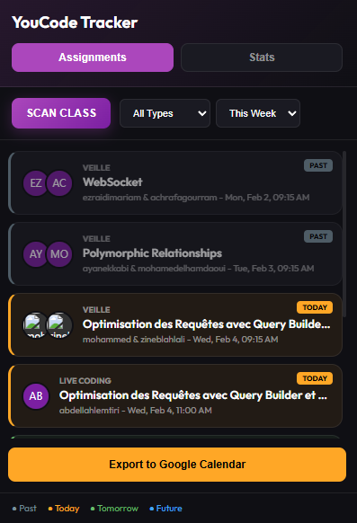

<div align="center">
  
  
  # YouCode Tracker
  
  **A Chrome extension for YouCode Intranet that helps you track Veille and Live Coding assignments across your entire class.**
  
  [](chrome://extensions/)
  [](https://github.com/)
  [](LICENSE)
</div>

---

## 📸 Preview

<div align="center">
  
  
  *Track all Veille and Live Coding assignments with a beautiful, intuitive interface*
</div>

---

## Features

- **Popup Interface**: Access from Chrome toolbar - no floating panels
- **Class Scanning**: Automatically detects all students on the current page
- **Stats Dashboard**: See how many Veilles/Live Coding each person has done
- **Google Calendar Export**: Export all assignments to .ics file
- **Assignment Types**: Filter by Veille or Live Coding
- **Date Filtering**: View assignments for this week or all time
- **Visual Date Status**:
  - Gray: Past assignments
  - Orange: Today's assignments
  - Green: Tomorrow's assignments
  - Blue: Future assignments
- **Grouped View**: Same assignments with multiple presenters are grouped together
- **Profile Photos**: Shows real profile pictures from the intranet

## Installation

1. Open Chrome and navigate to `chrome://extensions`
2. Enable **Developer Mode** (toggle in top right)
3. Click **Load Unpacked**
4. Select the `youcode-tracker` folder

## Usage

1. Navigate to a YouCode Intranet page with student listings (e.g., Leaderboard, Class View, Trombinoscope)
2. Click the **YouCode Tracker** icon in the Chrome toolbar
3. Click **SCAN CLASS** to fetch assignments for all visible students
4. Use the tabs to switch between:
   - **Assignments**: View all Veilles and Live Coding
   - **Stats**: See presenter statistics
5. Click **Export to Google Calendar** to download .ics file

## Files

```
youcode-tracker/
├── manifest.json    # Extension configuration
├── popup.html       # Popup UI
├── popup.css        # Popup styles
├── popup.js         # Popup logic
├── icons/           # Extension icons
└── README.md        # This file
```

## Requirements

- Google Chrome browser
- Access to YouCode Intranet (must be logged in)

## Color Legend

| Color  | Status   | Meaning                     |
|--------|----------|-----------------------------|
| Gray   | Past     | Assignment date has passed  |
| Orange | Today    | Assignment is today         |
| Green  | Tomorrow | Assignment is tomorrow      |
| Blue   | Future   | Assignment is in the future |

## Notes

- The extension only works on `*.youcode.ma` domains
- You must be logged into the intranet for fetching to work
- Navigate to a page with student profile links before scanning

## Version

2.0.0

## Changelog

### v2.0.0
- New popup-based interface (Chrome toolbar)
- Added Stats Dashboard
- Added Google Calendar export (.ics)
- Removed floating panel

### v1.0.0
- Initial release with floating panel
